# SOQrates: Polymarket S&P 500 Open Predictor

## Why I am publishing this

I published this simply because I no longer care about it. I found a game
that is potentially more profitable, with a much higher ceiling. This one has
a hard ceiling, and it is set by liquidity.

Polymarket's daily "SPX Opens Up or Down" market is small. You can only place
about **1% of a day's traded volume** before your own order starts moving the
price against you. Daily volume fell from about $664k in January 2026 to
$30-48k by July 2026, and the ceiling falls with it. At today's volume that
works out to **roughly $4-9k a year**:

```
1% of $30-48k daily volume                  =  $300-480 per trade
x $5.6-7.6 profit per $100 staked, per day  =  ~$17-36 per trading day
x 252 trading days                          =  ~$4-9k per year
```

And that is the best case: the trading edge below is promising, but not yet
statistically confirmed.

## Maybe it is fuel for someone else

Everything is here: the model, the data clients, the backtest, a strategy
simulator with a calibrated execution model, and a half-built replica of the
opening auction. The hard parts are measured, including the parts that did
not work out.

If you trade a bigger market, see a way around the liquidity limit, or want
to finish the auction replica, take it. I hope someone gets further with this
than I did, and that it helps you get there. The open work is listed under
[What is left to finish](#what-is-left-to-finish).

## The idea

Every trading day, Polymarket asks one question: **will the official S&P 500
open at 9:30 ET print above or below yesterday's close?**

Almost everyone answers it by watching the overnight futures. If the futures
are up 0.5%, they assume the open will be up 0.5% too. It is not. The official
open is not a traded price but a calculation: S&P recomputes the index about
every five seconds from the last price of each of its roughly 505 stocks, and
a stock that has not opened yet counts at yesterday's close. Nasdaq stocks
(57.5% of the index weight) open at exactly 9:30:00, but NYSE stocks open
seconds to minutes later, so the first tick still carries many of yesterday's
prices. That pulls the official open back
toward the prior close.

Measured over 200 trading days, **only about 80% of the overnight futures
move survives into the official open**. The crowd prices it as if 100% does.
That gap, plus knowing how uncertain to be at each hour of the night, is the
whole edge.

<picture>
  <source media="(prefers-color-scheme: dark)" srcset="docs/research/figures/readme/pipeline-dark.png">
  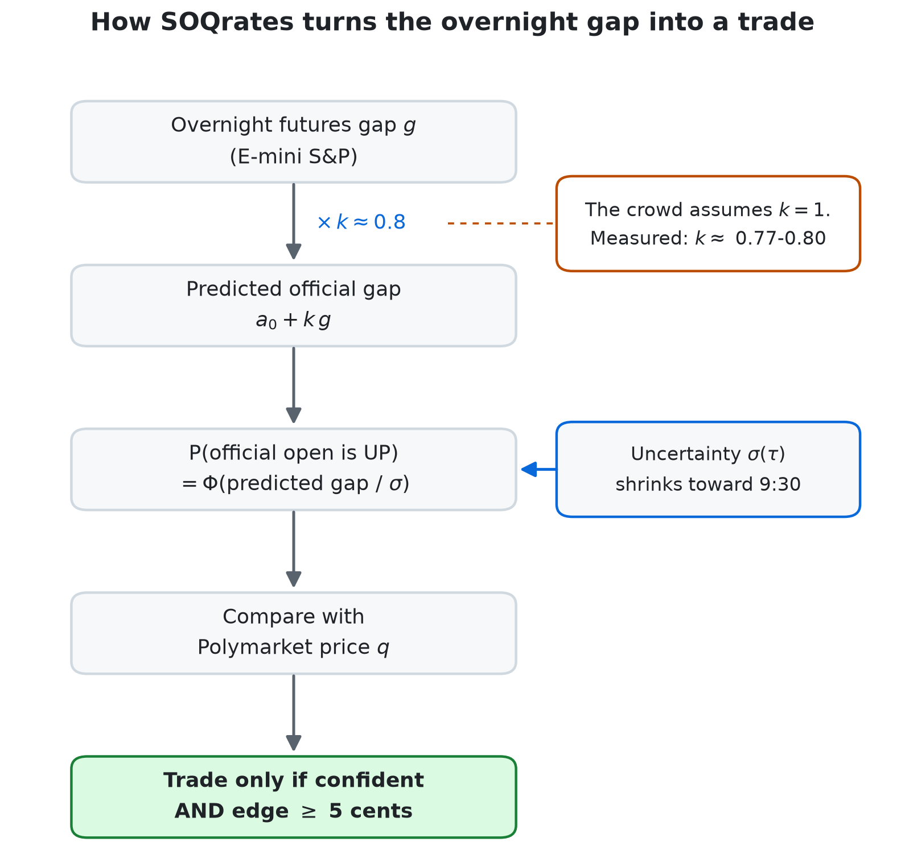
</picture>

## The model in formulas

Everything is fitted once on the first half of the data and never refit on
the test half.

**The core: one line plus a clock.** $`g`$ is the overnight E-mini futures
gap in % of the prior close, $`\tau`$ the minutes left until 9:30 ET. The
crowd prices $`k = 1`$ and $`\sigma = 0`$; measured, $`k \approx 0.77\text{-}0.80`$
and $`a_0 \approx 0`$.

```math
\hat g = a_0 + k\,g, \qquad
P(\mathrm{up}) = \Phi\!\left(\frac{a_0 + k\,g}{\sigma(\tau)}\right), \qquad
\sigma(\tau)^2 \approx 0.0066 + 0.0002\,\tau
```

The width is not a guess: the measured error shrinks from about 0.344% at
midnight to 0.083% at 9:29, and the linear clock fits that schedule.
Version 1.2 conditions $`k`$ on the volatility regime (0.733 calm, 0.827
mid, 0.839 volatile), and version 1.3 widens $`\sigma`$ with the one-day
volatility index VIX1D and adds the Nasdaq futures spread.

**Combining signals.** The futures core, the news voices, and later the
auction replica each give a center $`\mu_i`$ and a width $`\sigma_i`$. They
are pooled by inverse variance, so a noisy signal gets little say. The news
layer and the replica are built, but neither is part of the production call
yet:

```math
\mu_F = \frac{\sum_i \mu_i / \sigma_i^2}{\sum_i 1/\sigma_i^2}, \qquad
\frac{1}{\sigma_F^2} = \sum_i \frac{1}{\sigma_i^2}, \qquad
P(\mathrm{up}) = \Phi\!\left(\frac{\mu_F}{\sigma_F}\right)
```

How much room is there for news? The overnight uncertainty that disappears
between midnight and 9:29 bounds it:

```math
\sigma_{\mathrm{news}} = \sqrt{\sigma_{00:00}^2 - \sigma_{9:29}^2} = \sqrt{0.34^2 - 0.09^2} \approx 0.33\%
```

**From probability to a trade.** With model probability $`p_m`$ and market
price $`q`$ of the UP side (in USDC):

```math
c = \max(p_m,\ 1 - p_m), \qquad
e_{\mathrm{up}} = p_m - q, \qquad
e_{\mathrm{down}} = q - p_m
```

A side is bought only when its edge is at least 0.05 and the confidence
$`c`$ clears the rule's gate (0.60 to 0.70). Every fill pays Polymarket's
taker fee, where $`n`$ is shares filled and $`p`$ the price paid:

```math
f = n\,r\,p\,(1-p), \qquad r = 0.04
```

**How much to stake.** The stake on day $`t`$ is capped three ways: half the
bankroll $`B_t`$, a hard 400 USDC, and 1% of the day's traded volume
$`V_t`$. The last term is the liquidity ceiling from the top of this page:

```math
s_t = \min\!\left(\tfrac{1}{2}\,B_t,\ 400,\ 0.01\,V_t\right)
```

**Flip risk.** For a position already open, the chance that the effective
gap changes sign before 9:30, with the center drifting about 0.014% per
square-root minute:

```math
P(\mathrm{flip}) = \Phi\!\left(\frac{-\,\lvert 0.83\,g\rvert}{0.014\%\,\sqrt{\tau}}\right)
```

**The auction replica.** Rebuild the first tick stock by stock: weight
$`w_i`$, predicted first print $`\hat P_i`$, prior close $`C_i`$, counted only
if the stock opens in time for the first tick:

```math
\mu_R = \sum_i w_i \left(\frac{\hat P_i}{C_i} - 1\right)\mathbf{1}[\,i \in \text{first tick}\,]
```

**How the results are scored.** Brier score for probability quality (lower
is better, 0.25 is a coin flip), Wilson intervals for every accuracy, and
White's reality check to price in that the best of $`K`$ strategies was
picked ($`\bar f_k`$ is strategy $`k`$'s mean daily excess return, $`*b`$ a
bootstrap resample):

```math
\mathrm{Brier} = \frac{1}{n}\sum_{t=1}^{n}(p_t - y_t)^2, \qquad
\mathrm{CI}_{95} = \frac{\hat p + \frac{z^2}{2n} \pm z\sqrt{\frac{\hat p(1-\hat p)}{n} + \frac{z^2}{4n^2}}}{1 + z^2/n}
```

```math
V = \max_{k \le K} \sqrt{n}\,\bar f_k, \qquad
p_{\mathrm{adj}} = \frac{1}{B}\sum_{b=1}^{B}\mathbf{1}\!\left[\max_{k \le K}\sqrt{n}\left(\bar f^{\,*b}_k - \bar f_k\right) \ge V\right]
```

## How well it works

### Accuracy climbs toward the bell

<p align="center">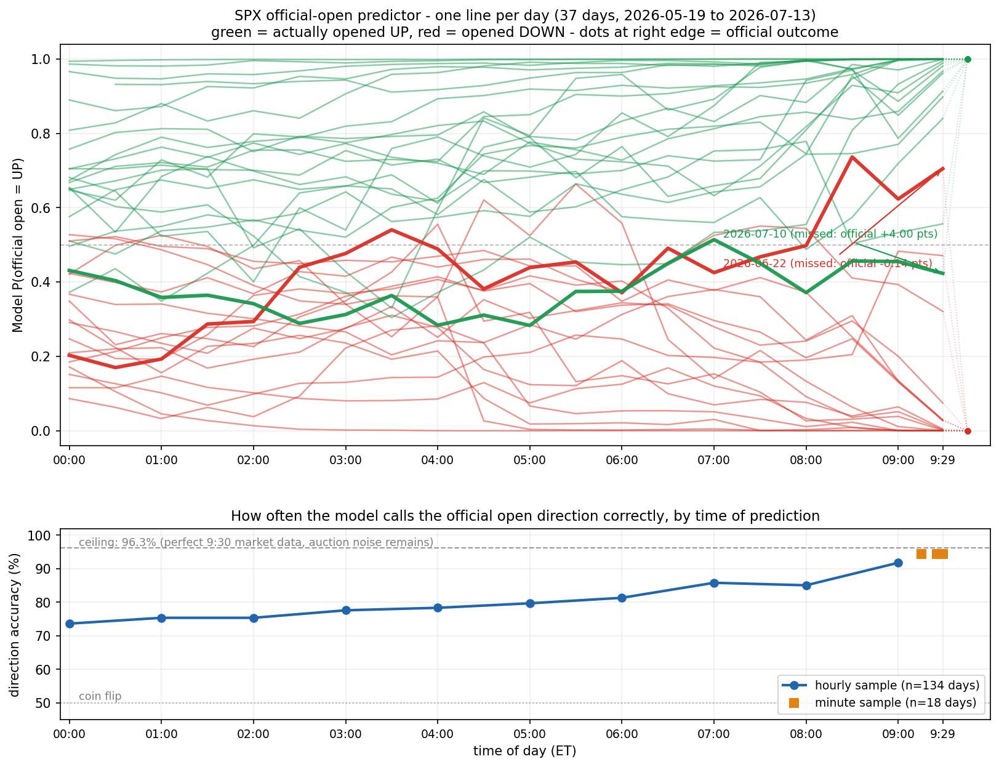</p>

Each line is one day's predicted probability that the open is UP, from
midnight to 9:29. Green days opened up, red days opened down. The closer to
9:30, the more the lines split toward the right answer.

<picture>
  <source media="(prefers-color-scheme: dark)" srcset="docs/research/figures/readme/accuracy-dark.png">
  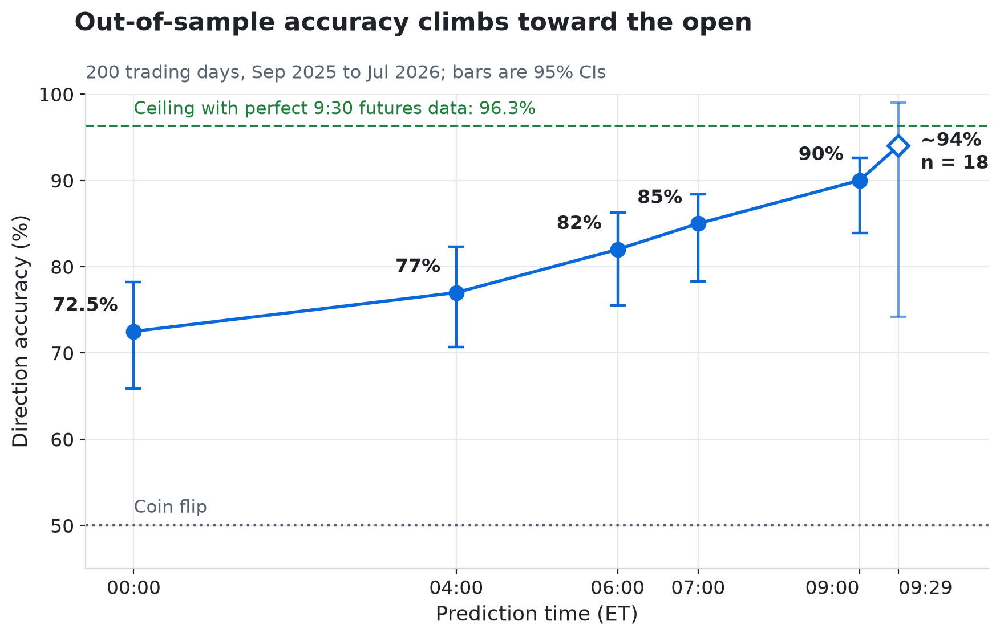
</picture>

<details>
<summary>The exact numbers</summary>

| Prediction time (ET) | Accuracy | 95% CI | Sample |
|---|---|---|---|
| 00:00 | 72.5% | 65.9-78.2% | 145/200 days |
| 04:00 | 77.0% | 70.7-82.3% | 154/200 days |
| 07:00 | 85% | 78.3-88.4% | 200 days |
| 09:00 | 90% | 83.9-92.6% | 200 days |
| 09:29 | ~94% | 74.2-99.0% | 18 days, minute-level |
| Ceiling with perfect 9:30 futures data | 96.3% | 89.7-98.7% | 81 unseen days |

</details>

The dashed line matters: even perfect futures data tops out at 96.3%. The rest is
decided inside the opening auction, which futures cannot see.

### Midnight calls, and knowing when to stand down

<p align="center">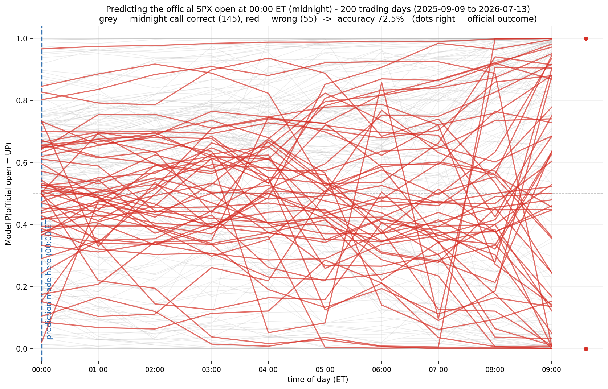</p>

At midnight the model calls 145 of 200 days right (72.5%). Many of the wrong
calls (red) start close to 50/50: the model itself was not sure.

<p align="center">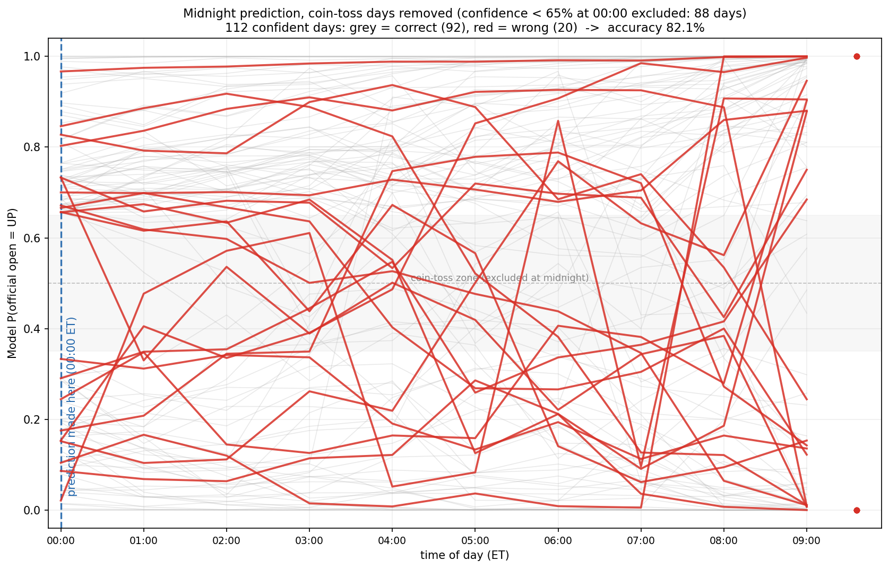</p>

So the rule is simple: **no bet on coin-toss days**. Skip the 88 days where
midnight confidence is below 65%, and 92 of the remaining 112 calls are right:
**82.1%**. By 04:00 the plain accuracy is already 77.0%:

<p align="center">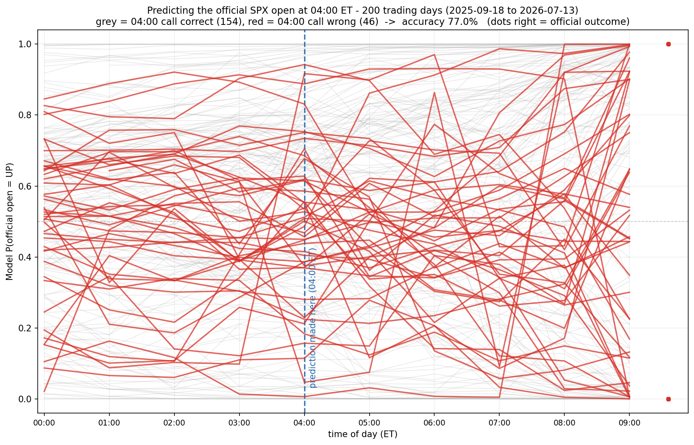</p>

### The probabilities mean what they say

<p align="center">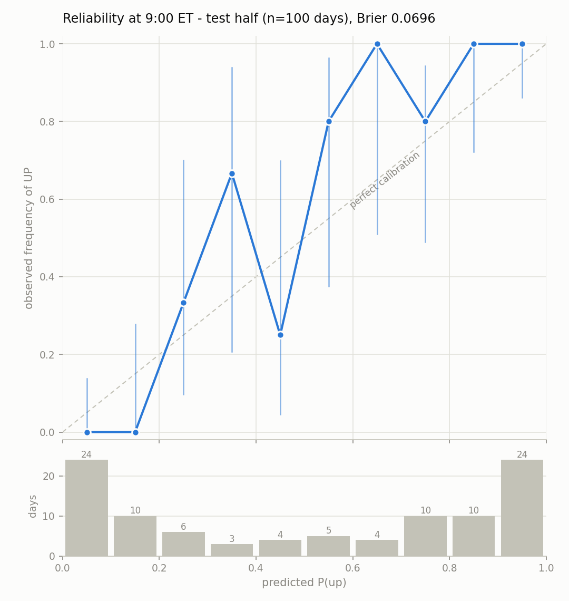</p>

On the 100 held-out test days at 9:00, the predicted probabilities line up
with how often the open actually went up (the dashed diagonal is perfect).
Most 9:00 calls are near-certain and right: 0 of 34 days opened up in the two
lowest bins, 34 of 34 in the two highest.

### Is the crowd simply wrong?

No, and this is the honest part. On matched test days the crowd is about as
accurate as the model on raw direction (77.1% against 77.0% at midnight) and
better calibrated from 04:00 on. The edge is narrower than "we predict
better":

- The crowd treats the futures gap as certain. That assumption alone scores a
  Brier of 0.2400 at midnight against the model's 0.1660 (lower is better).
- On all six days where SPY and SPX opened on opposite sides of the prior
  close, the crowd held the losing side at 94-99 cents.
- So the strategy only trades when the model is confident **and** the quoted
  price is at least 5 cents off.

### Where it fails: auction quirk days

<p align="center">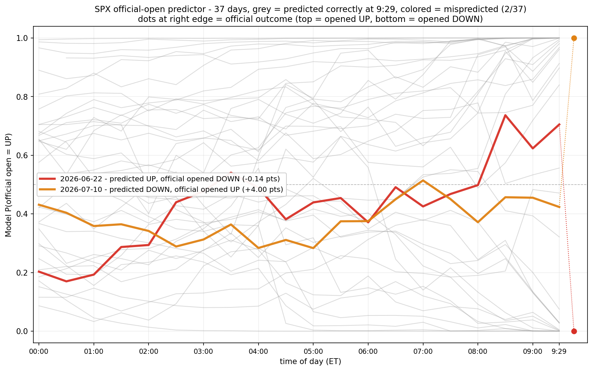</p>

About once a month the futures hold their direction and the official print
lands on the other side, or almost exactly flat. On 2026-06-22 the official
open was -0.14 points while every model version said +1.7 to +5.7. On
2026-07-10 the futures pointed down and the open printed +4.00 points. No
futures-based model can see these days. That is what the auction replica is
for.

### Trading it

<p align="center">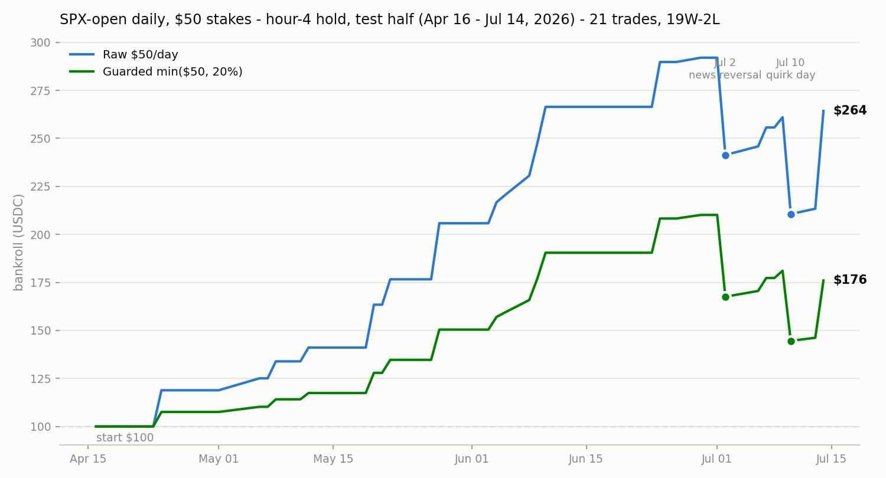</p>

Start with $100 and bet $50 a day, entering at 04:00 and holding to the open:
21 trades, 19 wins, 2 losses, and $100 becomes $264. The two losses are
marked: a news reversal on July 2 and a quirk day on July 10. A guarded
version that never stakes more than 20% of the bankroll ends at $176.

<p align="center">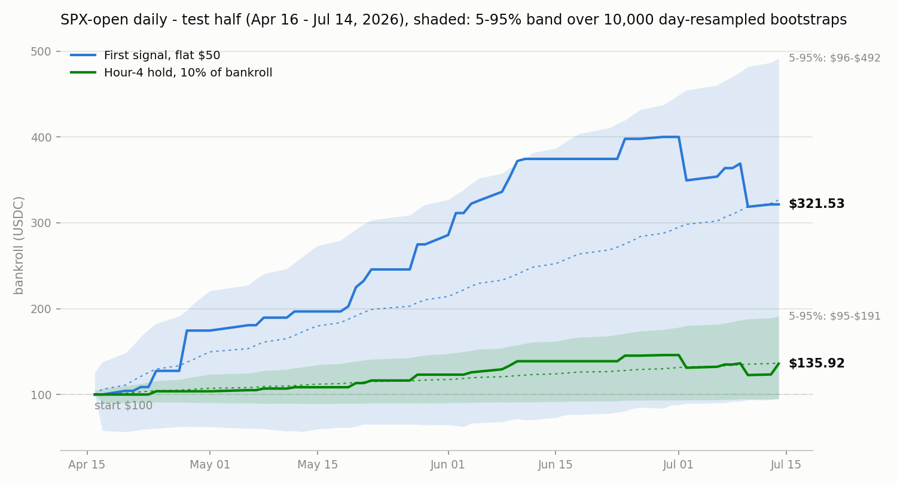</p>

Fifteen strategy candidates were tested with fees, spread, and price impact
modeled. One family survives on the 58 test days (2026-04-16 to 2026-07-14):

- **Enter at the first confident hour, flat $50 stakes:** $100 becomes
  $321.53, 26 wins against 2 losses.
- **Enter at 04:00 and hold, 10% of bankroll per trade:** $100 becomes $135.92,
  19 wins against 2 losses, never below the $100 start.

The shaded bands come from 10,000 resamples of whole days. Both end values
sit at their bootstrap medians, but about one resample in twenty still ends
slightly below $100.

The catch: picking the best of 15 candidates inflates the result. White's
reality check, which corrects for that, gives an adjusted p of 0.26-0.36
against a naive 0.03. **This is a promising backtest, not a measured return.**
Only live trading over more months can confirm it.

### The liquidity ceiling

<p align="center">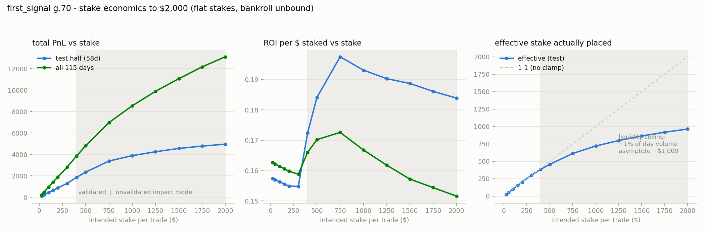</p>

This is the chart that made me stop. Return per dollar staked is flat at
about 15.5% from $25 to $300 per trade. Above that, fills bend away from the
stake you intended and flatten out near **$1,000, about 1% of a day's
volume**. Doubling the stake from $1,000 to $2,000 adds only about 27% more
profit. With volume now at $30-48k a day, the flat part ends even sooner.

## The unfinished part: an auction replica

Futures cannot see the quirk days, but the exchanges publish their opening
auctions before 9:30: Nasdaq's order imbalance feed (NOII), NYSE's imbalance
messages, and the cross prints themselves. The replica rebuilds the official
first tick from that data, stock by stock, using Databento (LSEG and free
feeds as fallbacks).

First measurement, out of sample on the 12 quirk days in the sample:

| Signal | Quirk days called |
|---|---|
| Auction replica | 5 of 12 |
| Futures model v1.3 | 2 of 12 |
| Futures model (production) | 1 of 12 |

The two signals were right on **completely different days** (zero overlap),
which points to combining them rather than replacing one with the other. With
only 12 days this is not statistically significant (McNemar p = 0.45 and
0.22).

## What is left to finish

In order of value:

1. **Fuse the replica with the futures model** and test on the same 12 quirk
   days. The fusion code exists (`fused_p_up` in
   `open_predictor/forecast/auction/pipeline.py`) but has never been measured.
2. **More quirk days.** Twelve is too few. `scripts/data/backfill.py` pulls
   more Databento history under a hard spend cap.
3. **Imbalance-versus-print accuracy on real days.** The deviation code has
   only run on 2019 ITCH sample files.
4. **A live morning loop with real fills**, paper trading first. This is the
   only way to confirm the edge.
5. **The news layer.** Pick an LLM provider from the benchmark and wire its
   bounded vote into the fusion.

The full plan with evidence is in `docs/tasks/complete-missing-gaps.md`, and
the questions the code alone cannot answer are in
`docs/build/system-guide/12-open-questions.md`.
